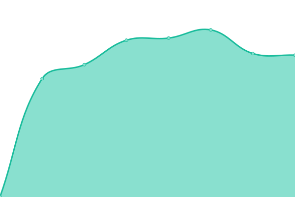
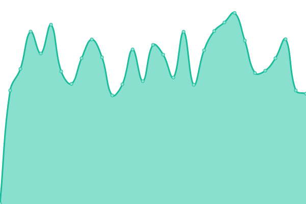
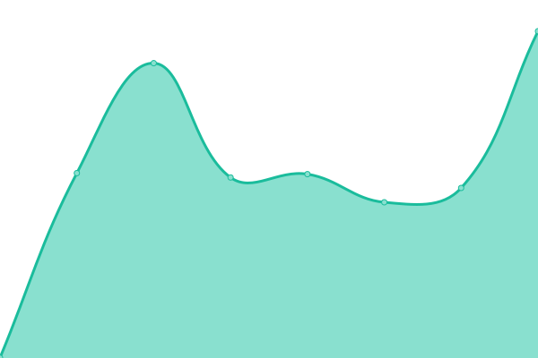
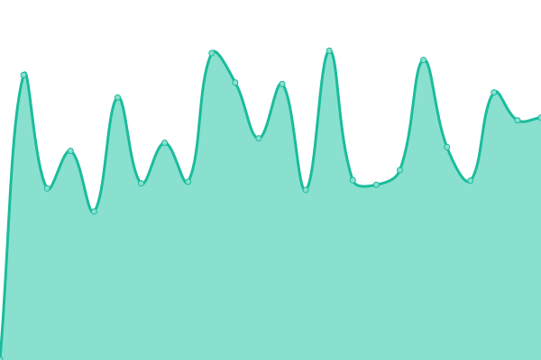
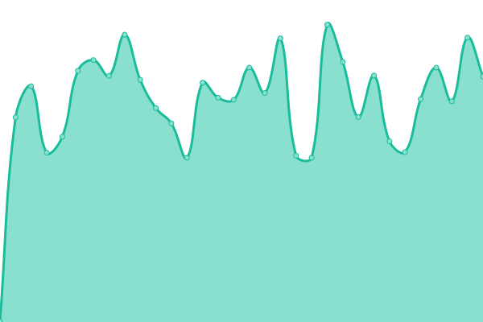
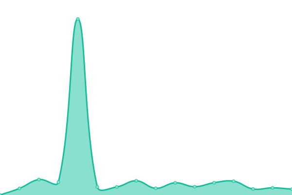

# [📈 Live Status](https://status.dreamension.fr): <!--live status--> **🟧 Partial outage**

This repository contains the open-source uptime monitor and status page for [Alex Baertsoen](http://alex.baertsoen.fr), powered by [Upptime](https://github.com/upptime/upptime).

With [Upptime](https://upptime.js.org), you can get your own unlimited and free uptime monitor and status page, powered entirely by a GitHub repository. We use [Issues](https://github.com/abaertsoen/upptime/issues) as incident reports, [Actions](https://github.com/abaertsoen/upptime/actions) as uptime monitors, and [Pages](https://status.dreamension.fr) for the status page.

<!--start: status pages-->
<!-- This summary is generated by Upptime (https://github.com/upptime/upptime) -->
<!-- Do not edit this manually, your changes will be overwritten -->
<!-- prettier-ignore -->
| URL | Status | History | Response Time | Uptime |
| --- | ------ | ------- | ------------- | ------ |
|  [BriefPoint](https://www.briefpoint.fr) | 🟩 Up | [brief-point.yml](https://github.com/abaertsoen/upptime/commits/HEAD/history/brief-point.yml) | 

 2776ms
     
 | 

<a href="https://status.dreamension.fr/history/brief-point">100.00%</a>
    

|  [Dreamension](https://dreamension.fr) | 🟩 Up | [dreamension.yml](https://github.com/abaertsoen/upptime/commits/HEAD/history/dreamension.yml) | 

 640ms
     
 | 

<a href="https://status.dreamension.fr/history/dreamension">100.00%</a>
    

|  [Infochat](https://www.infochat.fr) | 🟩 Up | [infochat.yml](https://github.com/abaertsoen/upptime/commits/HEAD/history/infochat.yml) | 

 2385ms
     
 | 

<a href="https://status.dreamension.fr/history/infochat">100.00%</a>
    

|  [JV360](https://jv360.fr) | 🟩 Up | [jv-360.yml](https://github.com/abaertsoen/upptime/commits/HEAD/history/jv-360.yml) | 

 775ms
     
 | 

<a href="https://status.dreamension.fr/history/jv-360">100.00%</a>
    

|  [Musga](https://musga.fr) | 🟩 Up | [musga.yml](https://github.com/abaertsoen/upptime/commits/HEAD/history/musga.yml) | 

 775ms
     
 | 

<a href="https://status.dreamension.fr/history/musga">100.00%</a>
    

|  [PetitGeste](https://petitgeste.fr) | 🟥 Down | [petit-geste.yml](https://github.com/abaertsoen/upptime/commits/HEAD/history/petit-geste.yml) | 

 0ms
     
 | 

<a href="https://status.dreamension.fr/history/petit-geste">0.00%</a>
    

|  [Shop Aishy](https://aishy.fr) | 🟩 Up | [shop-aishy.yml](https://github.com/abaertsoen/upptime/commits/HEAD/history/shop-aishy.yml) | 

 1867ms
     
 | 

<a href="https://status.dreamension.fr/history/shop-aishy">100.00%</a>
    

|  [Shop Yuudoku](https://yuudoku.jv360.fr) | 🟩 Up | [shop-yuudoku.yml](https://github.com/abaertsoen/upptime/commits/HEAD/history/shop-yuudoku.yml) | 

 1716ms
     
 | 

<a href="https://status.dreamension.fr/history/shop-yuudoku">100.00%</a>
    

<!--end: status pages-->

[**Visit our status website →**](https://status.dreamension.fr)

## 📄 License

- Powered by: [Upptime](https://github.com/upptime/upptime)
- Code: [MIT](./LICENSE) © [Alex Baertsoen](http://alex.baertsoen.fr)
- Data in the `./history` directory: [Open Database License](https://opendatacommons.org/licenses/odbl/1-0/)
